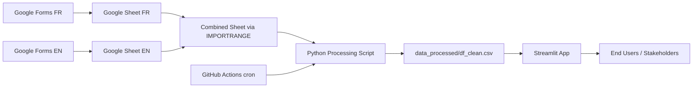

<p align="center">
  
</p>
<p align="center">  </p>


[](https://japantravelsurveyanalysis.streamlit.app/)


---

# Technical Documentation

## 1. Project Overview

This repository contains an end-to-end data pipeline and analytics application built around a survey about travel intentions to Japan, with a specific focus on the Yamagata prefecture.

The goal is to:
- Collect structured feedback from potential travellers in French and English.
- Centralize and standardize responses in a single cleaned dataset.
- Automate the data refresh process on a fixed schedule.
- Expose an interactive Streamlit dashboard that allows stakeholders (e.g. 360, local tourism actors) to explore the data and download filtered datasets.

Technically, this project demonstrates:
- Automated data ingestion from Google Sheets.
- Centralized data cleaning and standardization logic in Python.
- Scheduled data processing with GitHub Actions.
- A performant, cached Streamlit application for exploratory analysis.
- A clear separation between **data pipeline** and **data product**.

---

## 2. High-Level Architecture



### Key ideas:

- Two separate forms (FR/EN) feed two answer sheets.
- A third sheet uses ``IMPORTRANGE`` to centralize all responses.
- A Python script reads from the central sheet, cleans and standardizes the data, and writes a single processed CSV.
- The Streamlit app reads the processed CSV and provides interactive analysis.
- A GitHub Actions workflow runs on a bi-monthly schedule to keep the processed dataset up to date.

---

## 3. Data Collection Layer

- Forms:
    - ``Google Form (FR)`` – French questionnaire.
    - ``Google Form (EN)`` – English questionnaire.
    - The questionnaire contains branching logic (e.g. some questions are skipped if the user has no interest in Japan).

- Raw Storage:
    - ``Google Sheet FR`` and ``Google Sheet EN`` each collect responses from their respective forms.
    - A third sheet uses ``IMPORTRANGE`` to union the two sheets into a single combined table.

- Access Control:
    - Only the project owner has write access to the Google Sheets.
    - Sheets are protected to avoid accidental structure changes.
    - The Python script connects using the ``fileId`` and ``gid``, not the sheet name, to ensure robust identification of the data source.

---

## 4. Repository Structure

```
├── .devcontainer/                                        # Dev environment configuration (optional)
│   └── devcontainer.json
│
├── .github/
│   └── workflows/
│       └── run_clean_import.yml                          # GitHub Actions pipeline (bi-monthly)
│    
├── Archives/
│   ├── 01_clean.ipynb                                    # Early cleaning experiments (not used in prod)
│   └── Japan Travel Insights – Strategic Analysis.pdf    # Full strategic analysis (PDF deliverable)
│
├── Assets/
│   └── regions_of_japan.png                              # Image assets for README / dashboard
│
├── data_processed/
│   └── df_clean.csv                                      # Final cleaned dataset consumed by Streamlit
│
├── clean_import.py                                       # Main ETL script (cleaning + standardization)
│
├── JTSA_app.py                                           # Streamlit dashboard application
│
├── README.md                                             # Documentation (technical)
│
└── requirements.txt                                      # Python dependencies
```

## 5. Data Processing & Cleaning
### 5.1 Data Fetching

- The script connects to the combined Google Sheet using:
    - A ``fileId`` (unique ID of the Google Sheet file).
    - A ``gid`` (ID of the specific worksheet/tab).

In this project, the Google Sheet reference (fileId + gid) is stored directly inside the `clean_import.py` script for simplicity.  
No environment variables are required for data ingestion, since only public read-only data is fetched.

*__Note: The Google Sheet URL is stored directly in the script because the dataset contains no sensitive or private information.__*


### 5.2 Cleaning Rules Module

All data cleaning logic is centralized in ``clean_import.py.``

Typical responsibilities:

- Standardize languages (e.g. unify French/English values into a single language).
- Normalize categories (e.g. motivations, perceived barriers, budget ranges).
- Harmonize age groups, country names, and other categorical fields.
- Handle free-text responses by mapping them into broader categories where relevant.

Example:  
*Global cleaning helpers (functions)*
```python
def normalize_text(s):
    if pd.isna(s): return s
    return (str(s)
            .strip()
            .lower()
            .replace("à", "a").replace("â", "a").replace("ä", "a")
            ...
            .replace("$", "").replace("€", "").replace("-"," "))

def clean_age (age):
    if pd.isna(age):
        return None
    age = str(age).strip()
    if age.startswith("18"):
        return "18-24"
    elif age.startswith("25"):
        return "25-34"
    ...
    else:
        return "18 and less"

def list_to_fixed_cols_prefs(lst, k=MAX_CHOICES):
    lst = (lst + [np.nan]*k) [:k]
    return pd.Series(lst, index=[f"most_wanted_pref_to_visit_{i+1}" for i in range(k)])

```

*Mapping with and without normalization*
```python
#Japan_prefered_accomodation (normalize_text) 
clean_japan_accomodation = {

    "hotel classique (3 4 etoiles)": "Standard hotel (3–4 stars)",
    ...
    "hostel/ auberge de jeunesse": "Hostel"
}

#rating_interest_*
clean_rating_japan = {

    "Pas du tout important": "Not important at all",
    ...
    "Essentiel": "Essential",
}
```

*Multi-choice question processing*
```python
regions_list = df_clean["most_wanted_pref_to_visit"].apply(smart_split)
df_prefs = regions_list.apply(list_to_fixed_cols_prefs)
df_clean = pd.concat([df_clean, df_prefs], axis=1)
```

*Column-by-column cleaning*
```python
df_clean["nationality"] = (df_clean["nationality"]
                               .map(normalize_text)
                               .map(mapping)
                               .fillna(df_clean["nationality"]))
    
df_clean["age_group"] = df_clean["age_group"].apply(clean_age)

rating_cols = ['rating_interest_culture_and_history', 'rating_interest_food',
       'rating_interest_nature_hiking', 'rating_interest_shopping_and_techno',
       'rating_interest_events_and_festivals', 'rating_interest_wellness',
       'rating_interest_theme_park']
df_clean[rating_cols] = (df_clean[rating_cols]
                            .map(lambda x: clean_rating_japan.get(x, x)))
```

### 5.3 Orchestration Script

The orchestration of the end-to-end transformation is done with ``clean_import.py``:

```python
df_clean.to_csv("data_processed/df_clean.csv", index=False)
```

This script is:
- Executed manually during development.
- Triggered automatically by GitHub Actions on a schedule.

---

## 6. Streamlit Application

The Streamlit app is located in ``JTSA_app.py`` and is designed for interactive exploratory analysis.

Key features:
- Filters by nationality, age group, interest in Japan, preferred regions, perceived barriers, etc.

- Pre-built charts to understand:
    - Who is interested in visiting Japan.
    - Which regions/cities are most attractive.
    - Why some travellers are not interested in Japan or choose other destinations.

- Download buttons:
    - Full raw dataset.
    - Filtered subset based on selected filters.

### 6.1 Data Loading & Caching

- Context-aware choice :  
At the current scale of the project, the dataset remains relatively small and does not create any noticeable performance bottleneck during app startup or interactions.

- Caching strategy (disabled in production) :  
A caching mechanism using st.cache_data was implemented and tested during development, but is currently commented out in production as it does not provide meaningful performance gains at this stage.

- Future-ready configuration :  
If the dataset grows or refresh frequency increases, caching can be safely re-enabled with a short TTL aligned with the data refresh cycle.

```python
@st.cache_data(ttl=3 * 24 * 3600)  # 3 days
def load_data(path: str = "data_processed/df_clean.csv") -> pd.DataFrame: 
    df = pd.read_csv(path)
```

TTL rationale :  
A 3-day TTL was chosen as a reasonable balance between freshness and performance, and is better aligned with the current GitHub Actions update cadence than a longer cache duration (e.g. 15 days).

---

## 7. Automation with GitHub Actions

The workflow ``run_clean_import.yml`` is responsible for:
- Checking out the repository.
- Installing Python and dependencies.
- Loading environment variables / secrets (e.g. Google credentials, export URL).
- Running ``clean_import.py``.
- Committing and pushing the updated ``data_processed/df_clean.csv`` back to the repository (optional, depending on the chosen strategy).

Example structure:
```yml
name: Auto update cleaned data

on:
  schedule:
    - cron: "0 6 1,15 * *"   # 1er & 15 each month at 06:00 UTC
  workflow_dispatch:

# Give permission to write on to the repo
permissions:
  contents: write

jobs:
  run-cleaning-script:
    runs-on: ubuntu-latest

    steps:
      - name: Checkout repository
        uses: actions/checkout@v4
        with:
          ref: main          # make sur we are on the correct Branch

      - name: Set up Python
        uses: actions/setup-python@v5
        with:
          python-version: "3.11"

      - name: Install dependencies
        run: |
          pip install -r requirements.txt
          pip install --upgrade pip

      - name: Run cleaning script
        run: |
          python clean_import.py

      - name: Commit and push updated CSV
        run: |
          git config user.name "github-actions[bot]"
          git config user.email "github-actions[bot]@users.noreply.github.com"

          git add data_processed/df_clean.csv

          # Don't crash if nothing to commit
          git commit -m "Auto-update df_clean.csv via GitHub Actions" || echo "No changes to commit"

          # Push on to main
          git push origin HEAD:main
```

---

## 8. Future Work

Planned or possible extensions:

- Add an LLM-powered chatbot connected to the cleaned CSV to answer natural language questions about the dataset.
- Generate PDF reports based on user-selected charts.
- Implement segmentation / clustering of traveller profiles to support more targeted recommendations for tourism strategies.
- Add unit tests for key cleaning functions (e.g. country and age mappings).
- Add a decision-oriented KPI dashboard, including intent-based scoring and lifecycle-aware metrics (e.g. traveler intent score, regional diversification index).

--- 

## 9. Installation & Local Execution

```bash
# 1. Clone the repository
git clone https://github.com/JBaptisteAll/Japan_tourism_analysis.git
cd Japan_tourism_analysis

# 2. Install dependencies
pip install --upgrade pip
pip install -r requirements.txt

# 3. Run the ETL script (fetch + clean + export)
python clean_import.py

# 4. Launch the Streamlit dashboard
streamlit run JTSA_app.py
```

Notes
- ``clean_import.py`` retrieves the raw Google Sheet, cleans the dataset, and saves the processed version to ``data_processed/df_clean.csv``.
- The Streamlit app automatically loads the processed dataset and uses caching for performance.
- No environment variables are required, as the Google Sheet reference is stored directly in the script.

---

## 10. Contact
For questions or collaboration, please contact the project owner via GitHub or LinkedIn.