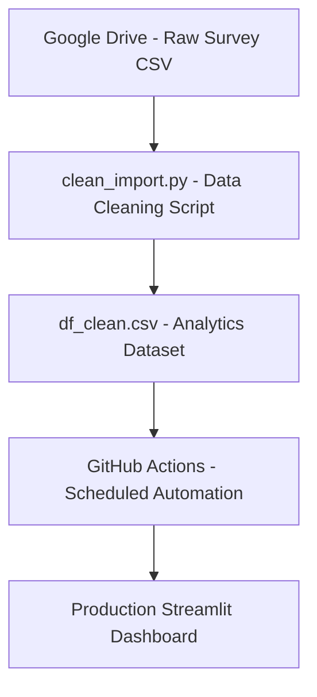

  

 Transforming raw survey responses into actionable tourism insights through automated data engineering,  CI/CD orchestration, and interactive analytics. 

---

---

## Executive Summary

**Japan Travel Insights** is a fully automated analytics solution designed to explore how international travelers perceive and plan a trip to Japan.
The project integrates:

- **Automated data ingestion and cleaning**  
- **CI/CD pipeline with GitHub Actions**  
- **A structured analytics-ready dataset updated twice per month**  
- **A production Streamlit dashboard for interactive exploration**  

The goal is to uncover key drivers of travel intent such as motivations, barriers, budgets, and preferred destinations and to provide an actionable data product for tourism stakeholders.  

This project demonstrates end-to-end ownership, from raw data to automated pipelines to production deployment.

---

## Business Problem

Understanding traveler decision-making is crucial for:

- 📈 Tourism boards aiming to promote specific regions
- 🛫 Travel agencies optimizing recommendations and packages
- 🎌 Local prefectures wanting to attract international visitors
- 🧭 Market analysts studying travel trends
- 📣 Marketing teams targeting audiences more effectively

However, survey data is often:

- messy
- multilingual
- inconsistent in formatting
- updated irregularly
- not directly exploitable for decision-making

Japan Travel Insights solves this by providing a clean, structured, automated, and interactive analytics framework.

---

## Solution Overview

The solution includes:

### 🔄 Automated Data Pipeline
A scheduled GitHub Actions workflow retrieves raw survey data, cleans and normalizes responses, and updates a production-ready dataset (df_clean.csv).

### 📊 Interactive Dashboard
A Streamlit app allows anyone, technical or not, to explore patterns in motivations, demographics, and destination preferences.

### 🧩 Analytics Layer
Standardized fields enable segmentation, ranking, demographic analysis, and tourism-focused KPIs.

### 🛠️ Engineering Best Practices
- Version-controlled transformations
- Modular Python cleaning script
- CI/CD deployment
- Cached data loading for performance

Together, these components form a reliable and scalable analytics product.

--- 

## Business Impact
This project can support tourism organizations by providing:

✔️ Identification of top travel motivations  
Culture, nature, food, safety, city exploration…

✔️ Insights on barriers  
Budget constraints, distance, language anxiety…

✔️ Demand forecasting  
Understanding which regions or prefectures attract the most interest.

✔️ Audience segmentation  
Age groups, nationalities, spending expectations, trip duration.

✔️ Data-driven content strategy  
What travelers want to experience → what destinations should promote.

✔️ Automation = no manual maintenance  
Zero manual cleaning, fully reproducible pipeline.

This transforms raw survey responses into an ongoing strategic asset.

---

## System Architecture

This architecture enables a hands-off, always-fresh data pipeline.

---

## Data Model Overview

### Raw Dataset Contains
- Age
- Nationality
- Budget
- Motivations
- Barriers
- Preferred prefectures / regions
- Free-text responses
- Multilingual answers

### Cleaning & Transformation Includes
- Standardization of free-text responses
- Normalization of age brackets
- Harmonization of languages
- Deduplication & missing data treatment
- Mapping responses to structured categories
- Export to `data_processed/df_clean.csv`

The result is a stable, analytics-ready dataset suitable for BI, machine learning, or tourism research.

--- 

## Automated Data Pipeline (CI/CD)
A GitHub Actions workflow runs on the 1st and 15th of each month.

### 🔄 Pipeline Steps
1. Fetch raw CSV from Google Drive  
2. Execute `clean_import.py`  
3. Clean, normalize, and restructure the data  
4. Save processed dataset to `data_processed/df_clean.csv`  
5. Commit and push changes to the `main` branch
6. Streamlit redeploys automatically

This ensures the dashboard always reflects the most recent survey results without manual intervention.

---

## Streamlit Dashboard

The dashboard provides an intuitive and interactive interface for exploring tourism insights.

### 📊 Key Features

- Dynamic filters (age, nationality, budget, motivations, barriers…) 
- Interactive charts powered by Plotly 
- A map of Japan showing preferred prefectures
- Toggle between percentages and absolute counts  
- Rankings for motivations and destinations
- Full exploration of demographics and travel intent  

The dashboard updates automatically when the pipeline pushes new data.

---

## Insights Unlocked

This solution provides valuable insights such as:

🎌 Top Prefectures & Regions  
Which parts of Japan attract global travelers most?

💸 Budget Patterns  
How much different demographics expect to spend?

🧭 Experience Preferences  
Nature? Food? Pop culture? Historical sites?

🚧 Travel Barriers  
Cost, distance, language, accessibility…

🌍 International Segmentation  
How motivations differ between countries.

📊 Behavioral Trends  
What drives the decision to visit Japan?

These insights can directly support tourism strategy and marketing decisions.

---

## Deployment

The dashboard is hosted on Streamlit Community Cloud.

Any new `df_clean.csv` pushed by the pipeline → triggers an automatic redeploy → dashboard always stays up to date.

👉 Live App: _[Link to the Web App](https://japantravelsurveyanalysis.streamlit.app)_

---

## Future Enhancements

Planned improvements include :

- Time-based trend analysis as responses grow  
- Clustering to identify traveler personas  
- Automated PDF insight reports  
- Emplementation of a Chatbot with OpenAi API key 

---

## About the Author

Built by JB, Data Analyst & Analytics Engineer.

- Portfolio: https://jbaptisteall.github.io/JeanBaptisteAllombert  
- Contact: https://linktr.ee/jb_contactme  

---

## 🎌 Final Notes

This project showcases:

- Real-world data cleaning  
- Automated CI/CD data workflows  
- Modern dashboard development  
- Analytics engineering best practices  
- Tourism insight generation
- Data storytelling at scale  
- End-to-end product thinking

By combining **Python**, **GitHub Actions**, and **Streamlit**, this project completes the full lifecycle from `raw data` → `clean data` → `automated pipeline` → `interactive insights`.

It demonstrates the ability to build scalable, maintainable, production-ready data products.
